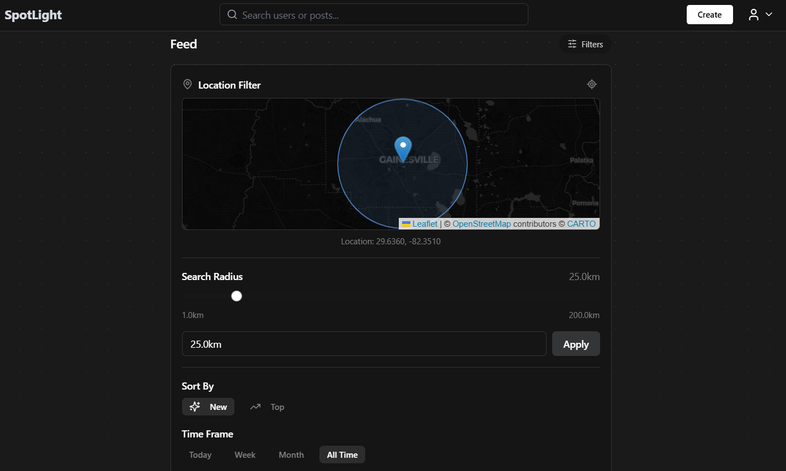
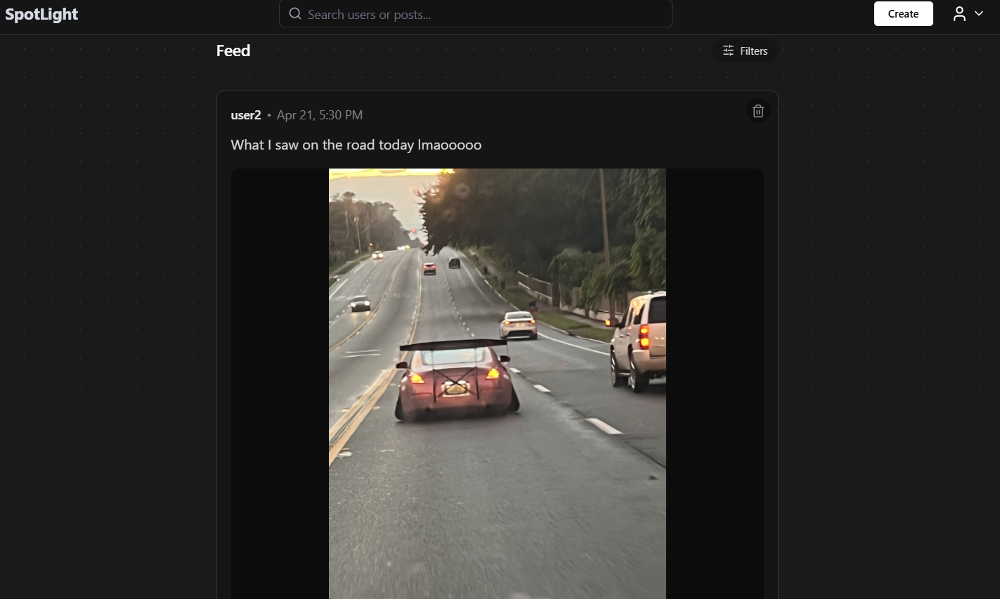

# SpotLight




## About

A geolocation-based platform for sharing and discovering posts tied to places around you. It's a social media app where users share updates, memes, and media to friends in their area!

## How to Build and Run

### For the backend:
* ```cd backend```
* ```go build -o ./server.exe ./src```
* ```./server.exe```

### For the frontend:
* ```cd frontend```
* ```npm install```
* ```npm run dev```

## For Running Backend Tests:
#### All Unit Tests:
* ```cd backend/testing/backend```
* ```go test .```

## For running Frontend Tests:
#### Unit Tests:
* ```cd frontend```
* ```npm test```

#### Cypress Tests:
* ```cd frontend```
* ```npx cypress open```
* Select test to run in the GUI

## Members

* Boris Russanov
* Bryan Etzine
* Kevin Wagner
